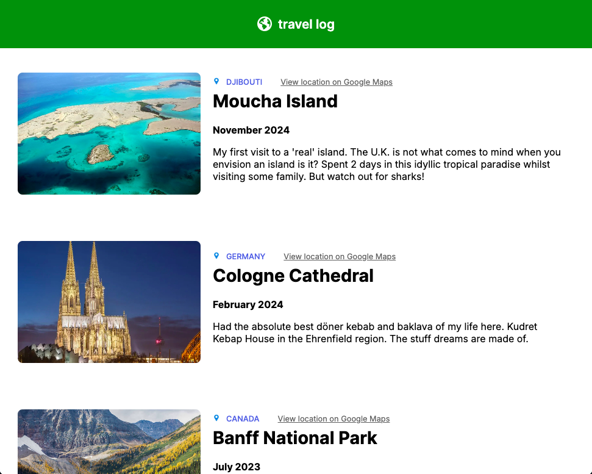

# 🌍 Travel Log

Travel Log is a static, responsive web page detailing my travels.

The application is built with:
- React.js
- JavaScript
- HTML & CSS
- Vite (a frontend build tool for fast builds and local development)


Currently, two official plugins are available:

## Getting Started

To run this application locally:

1. **Clone the repository:**
   ```bash
   git clone https://github.com/ehelsan/travel-log.git
   cd travel-log

2. **Install dependencies:**
   ```bash
   git clone https://github.com/ehelsan/travel-log.git
   cd travel-log


3. **Start the development server:**
   npm run dev

3. **Open in your browser:**
   The port will be at: http://localhost:5173/